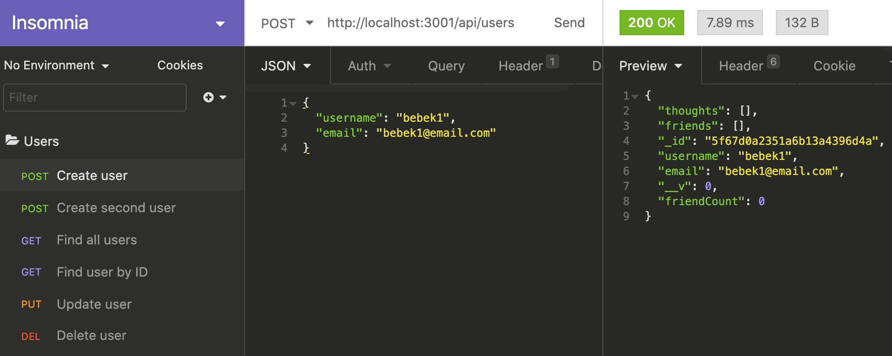
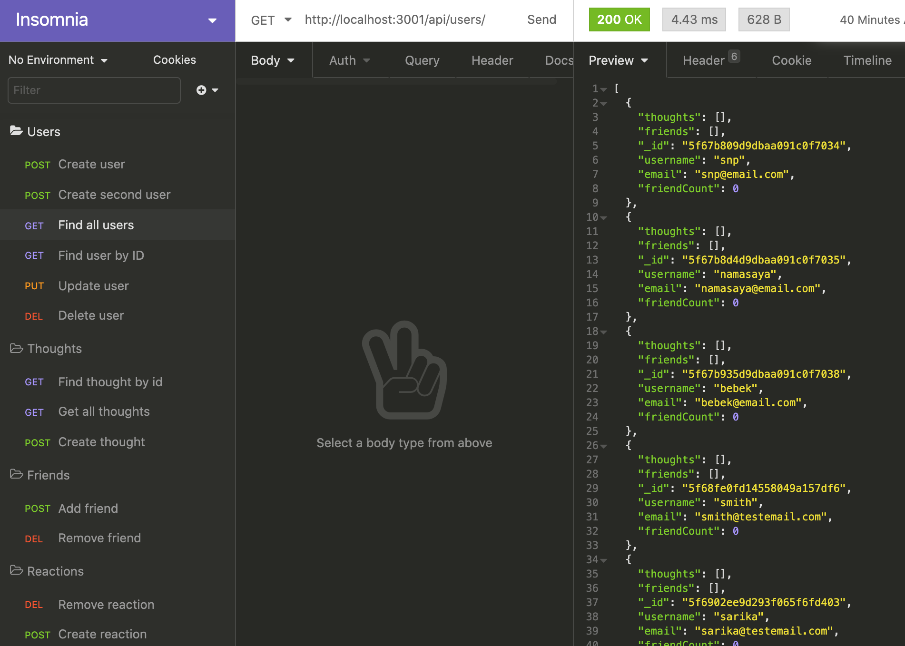
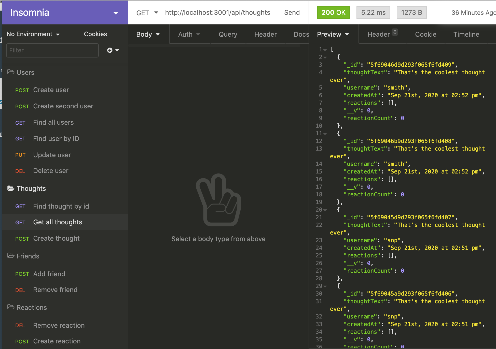
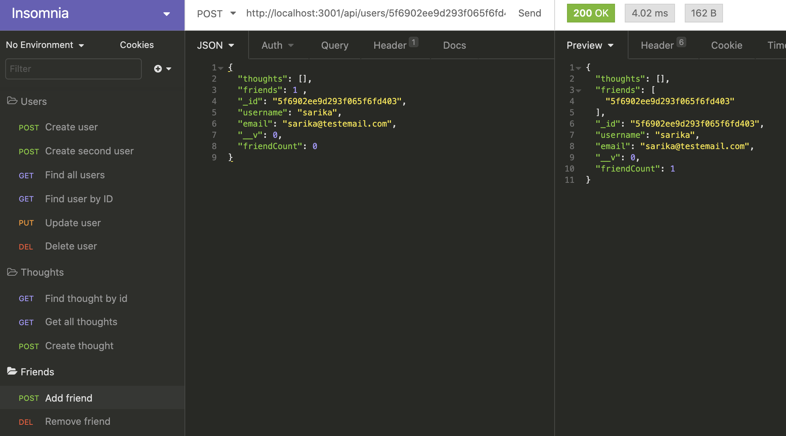
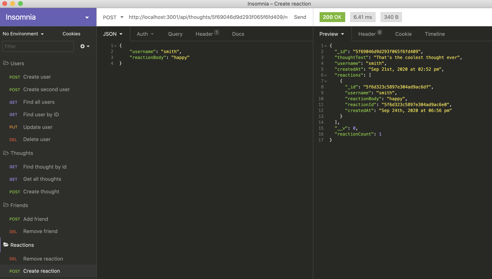

# social-netwrok-API

An API for a social network web application, where users can share their thoughts, react to friends' thoughts and create a friend list.

### Walkthrough video 
Sorry, was unable to get a good quality video with my poor upload speed! Images down below !

## Description
An API for a social network web application, where users can share their thoughts, react to friends' thoughts and create a friend list.

## Usage
- Application allows to add accounts with usernames and emails.
- I am able to create, read, update and delete(CRUD) users.
- This application allows me to add friends and show many friends I have.
- This application allows me to create and find reactions and thoughts.
- I am able to delete reactions, thoughts and remove friends.

## Screenshots

## Technologies Use

<a href="https://www.mongodb.com/">MongoDB</a>

<a href="https://www.npmjs.com/package/mongoose">Mongoose</a>

<a href="https://nodejs.org/">Node.js</a>

<a href="https://www.npmjs.com/package/express">Express.js</a>

<a href="https://www.npmjs.com/package/moment">Moment.js</a>

